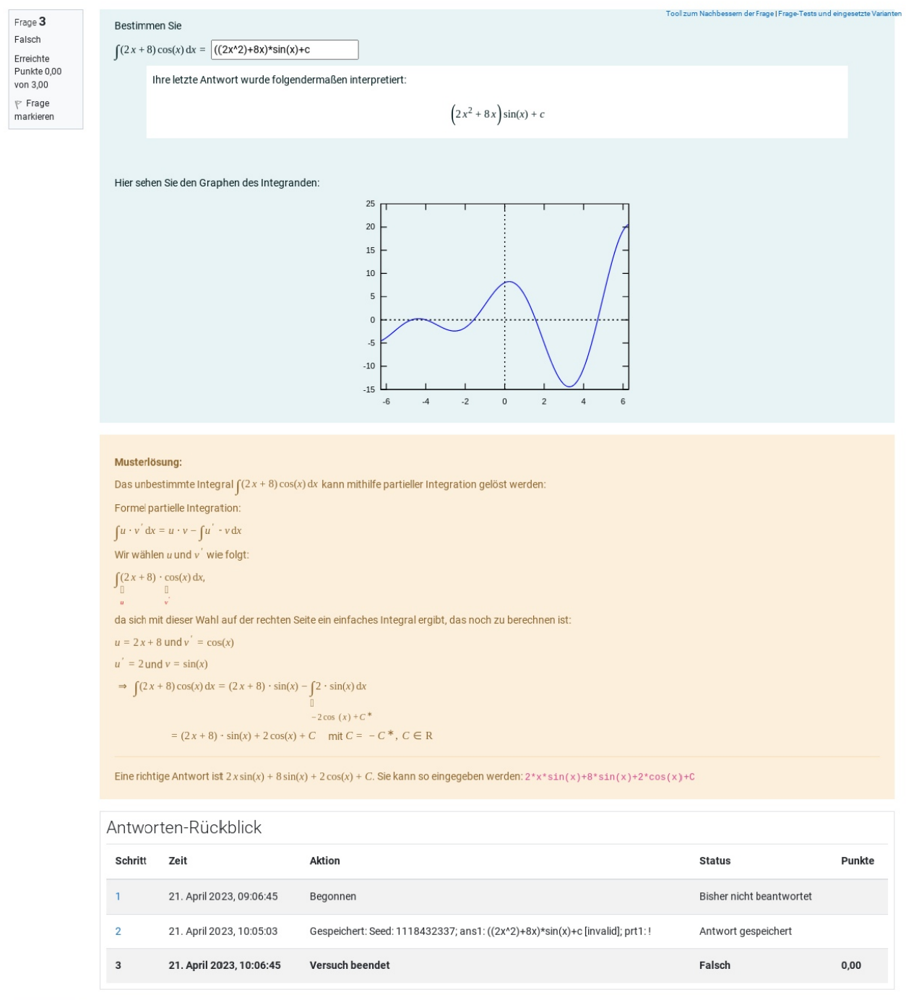

# Quiz Archiver

Archives quiz attempts as PDF and HTML files for long-term storage independent
of Moodle. Moodle backups (`.mbz`) of both the quiz and the whole course can be
included if desired. A checksum is calculated for every file within the archive
as well as the archive itself, to allow verification of file integrity.

Quiz archives are created by an external quiz archive worker service to remove
load from Moodle and to eliminate the need to install a large number of software
dependencies on the webserver.

## Concept

Archive jobs are execute via an external quiz archive worker service. It uses the
Moodle webservice API to query the required data and to upload the created archive.

This plugin prepares the archive job within Moodle, provides quiz data to the
archive worker, handles data validation, and stores the created quiz archives
inside the Moodle filestore. Created archives can be managed and downloaded via
the Moodle web interface. A unique webservice access token is generated for every
archive job. Each token has a limited validity and is invalidated either after
job completion or after a specified timeout. This process requires a dedicated
webservice user to be created (see [Configuration](#configuration)). A single job
webservice token can only be used for the specific quiz that is associated with
the job to restrict queryable data to the required minimum.

## Installation

You can install this plugin like any other Moodle plugin, as described below.
However, keep in mind that you additionally need to deploy the external quiz
archive worker service for this plugin to work.

### Installing via uploaded ZIP file

1. Log in to your Moodle site as an admin and go to _Site administration >
   Plugins > Install plugins_.
2. Upload the ZIP file with the plugin code. You should only be prompted to add
   extra details if your plugin type is not automatically detected.
3. Check the plugin validation report and finish the installation.

### Installing manually

The plugin can be also installed by putting the contents of this directory to

    {your/moodle/dirroot}/mod/quiz/report/archiver

Afterward, log in to your Moodle site as an admin and go to _Site administration >
Notifications_ to complete the installation.

Alternatively, you can run

    $ php admin/cli/upgrade.php

to complete the installation from the command line.

## Configuration

To set this plugin up, execute the following steps:

1. Create a designated Moodle user for the quiz archiver webservice
   (e.g., `quiz_archiver`) with the following rights:
   - `mod/quiz:grade`
   - `mod/quiz:view`
   - `moodle/backup:*`
   - `moodle/course:ignoreavailabilityrestrictions`
   - `moodle/course:view`
   - `moodle/course:viewhiddencourses`
   - `moodle/user:ignoreuserquota`
   - `quiz/grading:viewstudentnames`
   - `quiz/grading:viewidnumber`
   - `webservice/rest:use`
2. Create a new `quiz_archiver` external service at `$CFG->wwwroot/admin/settings.php?section=externalservices`
   - Enable file download and upload for this service
3. Add all `quiz_archiver_*` webservice functions to the `quiz_archiver` external
   service.
4. Configure `quiz_archiver` plugin settings at `$CFG->wwwroot/admin/settings.php?section=quiz_archiver_settings`
   1. Set `worker_url` to the URL under which the quiz archive worker can be
      reached (e.g., `http://quiz-archive-worker:5000` or `http://127.0.0.1:5000`)
   2. Select the in step (2.) created `quiz_archiver` webservice for `webservice_id`
   3. Enter the user ID of the in step (1.) created Moodle user for `webservice_userid`
   4. (Optional) Specify a custom job timeout in minutes
   5. (Optional) Specify a custom Moodle base URL. This is required if you run
      the quiz archive worker in an internal/private network, e.g., when using
      Docker. If this setting is present, the public Moodle `wwwroot` will be
      replaced by the `internal_wwwroot` setting.
      Example: `https://your.public.moodle/` will be replaced by `http://moodle.local/`.
5. Save all settings and create your first quiz archive (see [Usage](#usage)).

### Known pitfalls

- **Access to (some) webservice functions fails**
  - Ensure that all required webservice functions are enabled for the 
    `quiz_archiver` webservice.
  - Ensure that the `quiz_archiver` webservice has the rights to download and
    upload files.
  - Ensure that the `quiz_archiver` webservice user has accepted all site policies
    (e.g., privacy policy).
- **Upload of the final archive fails**
  - Ensure you have configured `php` to accept large file uploads. The
    `upload_max_filesize` and `post_max_size` settings in your `php.ini` should
    be set to a value that is large enough to allow the upload of the largest
    quiz archive file that you expect to be created.
  - Ensure that your Moodle is configured to allow large file uploads.
    `$CFG->maxbytes` should be set to the same value as PHP `upload_max_filesize`.
  - If you are using an ingress webserver and `php-fpm` via FastCGI, ensure that
    the `fastcgi_send_timeout` and `fastcgi_read_timeout` settings are long
    enough to allow the upload of the largest quiz archive file that you expect.
    Nginx usually signals this problem by returning a '504 Gateway Time-out'
    after 60 seconds (default).
  - Ensure that your antivirus plugin is capable of handling large files. When
    using ClamAV you can control maximum file sizes by setting `MaxFileSize`,
    `MaxScanSize`, and `StreamMaxLength` (when using a TCP socket) inside
    `clamd.conf`.

## Usage

Once installed and set up, quizzes can be archived by performing the following
steps:

1. Navigate to a Moodle quiz
2. Inside the `Quiz administration` menu expand the `Results` section and click
   on `Quiz Archiver`
3. Select the desired options and start the archive job by clicking the `Archive 
   quiz` button
4. Wait until the archive job is completed. You can now download the archive
   from the `Quiz Archiver` page using the `Download archive` button.

Created archives can be deleted by clicking the `Delete archive` button.

## Screenshots

### Quiz Archiver overview page

### New job queued while another job is running

### Example of PDF report (extract)

## License

2023 Niels Gandraß <niels@gandrass.de>

This program is free software: you can redistribute it and/or modify it under
the terms of the GNU General Public License as published by the Free Software
Foundation, either version 3 of the License, or (at your option) any later
version.

This program is distributed in the hope that it will be useful, but WITHOUT ANY
WARRANTY; without even the implied warranty of MERCHANTABILITY or FITNESS FOR A
PARTICULAR PURPOSE.  See the GNU General Public License for more details.

You should have received a copy of the GNU General Public License along with
this program.  If not, see <https://www.gnu.org/licenses/>.
