# Quiz Archiver

Archives quiz attempts as PDF and HTML files for long-term storage independent
of Moodle. Moodle backups (`.mbz`) of both the quiz and the whole course can be
included, if desired. A checksum is calculated for every file within the archive
as well as the archive itself, to allow verification of file integrity.
Comprehensive archive settings allow to select what should be included in the
generated reports on a fine-granular level (e.g., exclude example solutions,
include answer history, ...).

Quiz archives are created by an external [quiz archive worker](https://github.com/ngandrass/moodle-quiz-archive-worker)
service to remove load from Moodle and to eliminate the need to install a large
number of software dependencies on the webserver. It can easily be deployed
using Docker.

## Concept

Archive jobs are execute via an external quiz archive worker service. It uses the
Moodle webservice API to query the required data and to upload the created archive.

This plugin prepares the archive job within Moodle, provides quiz data to the
archive worker, handles data validation, and stores the created quiz archives
inside the Moodle filestore. Created archives can be managed and downloaded via
the Moodle web interface. A unique webservice access token is generated for every
archive job. Each token has a limited validity and is invalidated either after
job completion or after a specified timeout. This process requires a dedicated
webservice user to be created (see [Configuration](#configuration)). A single job
webservice token can only be used for the specific quiz that is associated with
the job to restrict queryable data to the required minimum.

## Installation

You can install this plugin like any other Moodle plugin, as described below.
However, keep in mind that you additionally need to deploy the external quiz
archive worker service for this plugin to work.

### Installing via uploaded ZIP file

1. Log in to your Moodle site as an admin and go to _Site administration >
   Plugins > Install plugins_.
2. Upload the ZIP file with the plugin code. You should only be prompted to add
   extra details if your plugin type is not automatically detected.
3. Check the plugin validation report and finish the installation.

### Installing manually

The plugin can be also installed by putting the contents of this directory to

    {your/moodle/dirroot}/mod/quiz/report/archiver

Afterward, log in to your Moodle site as an admin and go to _Site administration >
Notifications_ to complete the installation.

Alternatively, you can run

    $ php admin/cli/upgrade.php

to complete the installation from the command line.

## Configuration

The following sections describe the required steps to set up the plugin.

In summary: You need to create a dedicated Moodle user, a global role to manage
permissions, setup a webservice for the archive worker, and set configuration
options for the Moodle plugin.

### 1. Prerequisites

Installation of the additional [quiz archive worker service](https://github.com/ngandrass/moodle-quiz-archive-worker)
is mandatory for this plugin to work.

**Detailed installation instructions can be found here:
[Quiz Archive Worker: Installation](https://github.com/ngandrass/moodle-quiz-archive-worker#installation)**

### 2. Create Moodle User and Role

1. Create a designated Moodle user for the quiz archiver webservice (e.g., `quiz_archiver`).
   1. Navigate to `Site Administration` > `Users` (1) > `Accounts` > `Add a new user` (2).
   2. Set a username (e.g. `quiz_archiver`) (3), a password (4), first and
      lastname (5), and a hidden email address (6).
   3. Create the user (7).
   
   
   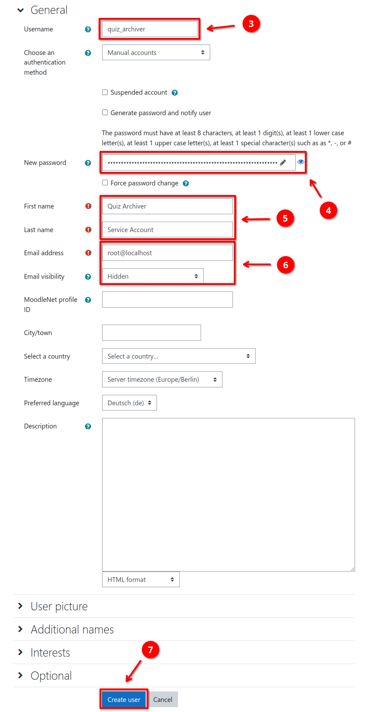

2. Create a global role to define permissions of the `quiz_archiver` Moodle user.
   1. Navigate to `Site Administration` > `Users` (1) > `Permissions` > `Define roles` (2)
   2. Select `Add a new role` (3)
   3. Set `Use role or archetype` (4) to `No role`
   4. Upload the role definitions file from [res/moodle_role_quiz_archiver.xml](res/moodle_role_quiz_archiver.xml) (5).
      This will automatically assign all required capabilities. You can check all
      capabilities in the next step or by manually inspecting the [role definition XML file](res/moodle_role_quiz_archiver.xml).
   5. Click on `Continue` (6) to import the role definitions for review
   6. Optionally change the role name or description and create the role (7)
   
   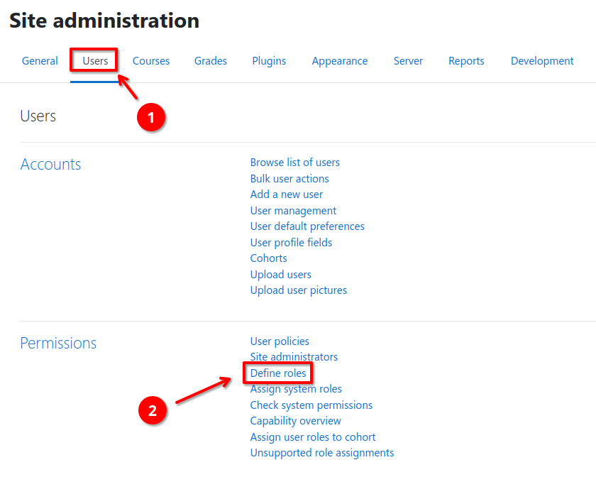
   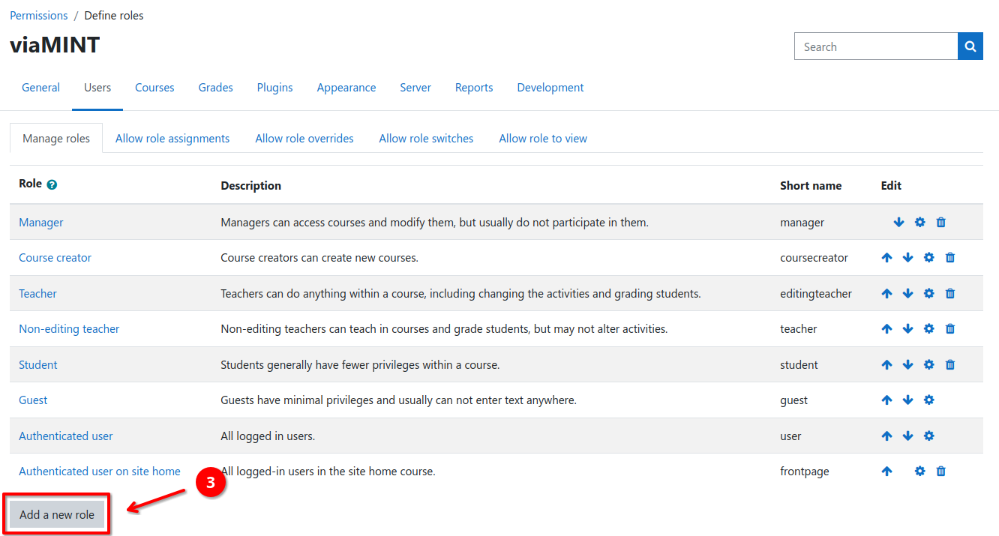
   
   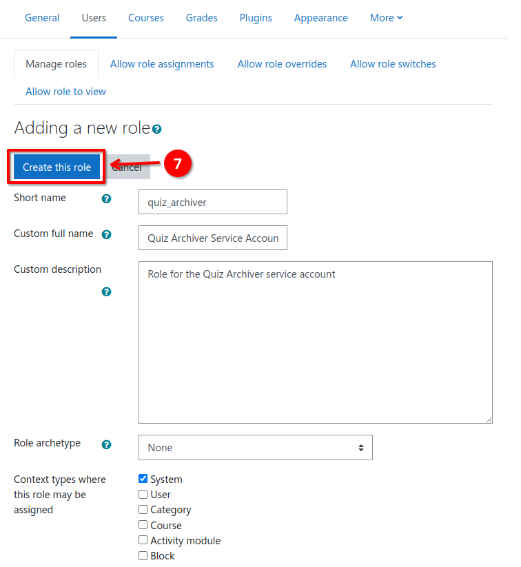

3. Assign the `quiz_archiver` Moodle user to the created role.
   1. Navigate to `Site Administration` > `Users` (1) > `Permissions` > `Assign system roles` (2)
   2. Select the `Quiz Archiver Service Account` role (3)
   3. Search the created `quiz_archiver` Moodle user (4), select it in the list
      of potential users (5), and add it to the role (6)
   
   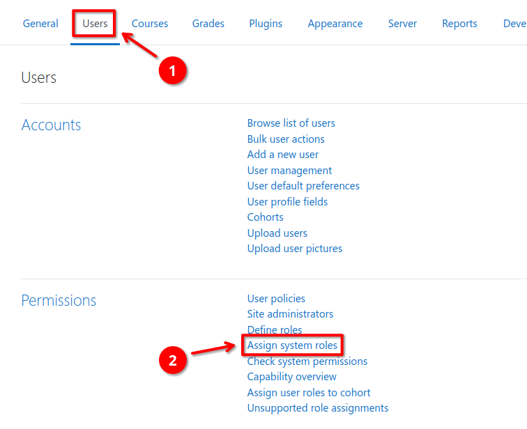
   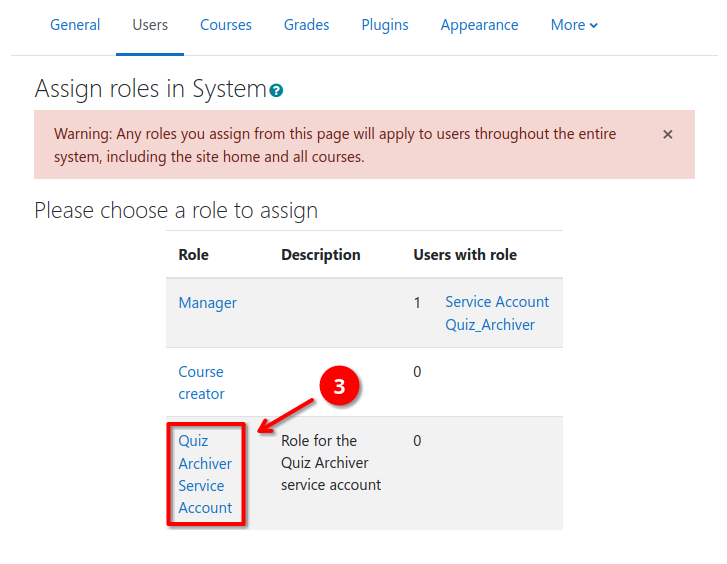
   

### 3. Setup Webservice
1. Create an external webservice for the quiz archive worker to use
   1. Navigate to `Site Administration` > `Server` (1) > `Web services` > `External services` (2)
   2. Under the `Custom services` section, select `Add` (3)
   3. Enter a name (e.g. `quiz_archiver`) (4) and enable it (5)
   4. Expand the additional settings (6), enable file up- and download (7)
   5. Create the new webservice by clicking `Add service` (8)
   
   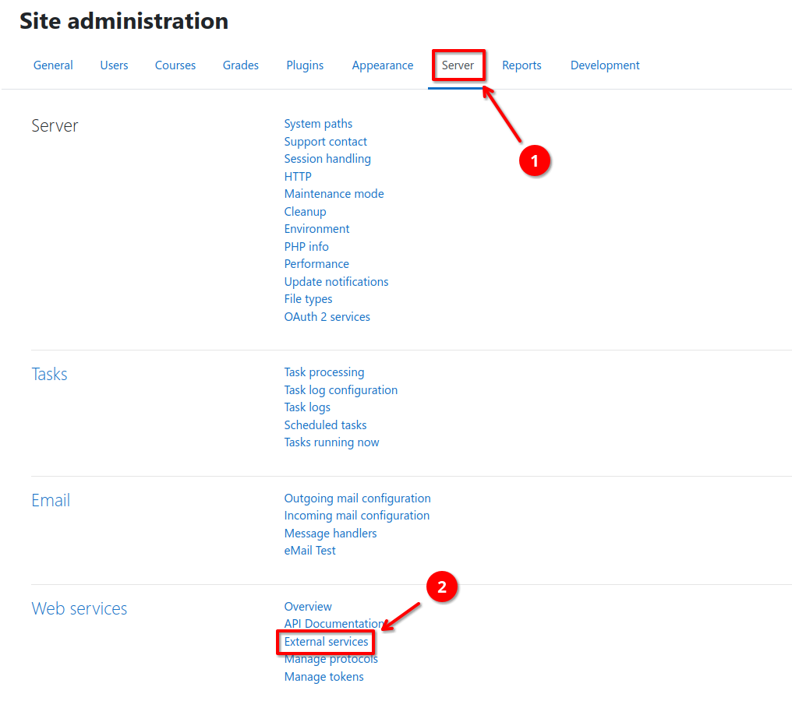
   
   
2. Add all `quiz_archiver_*` webservice functions to the `quiz_archiver` external
   service.
   1. Navigate to `Site Administration` > `Server` (1) > `Web services` > `External services` (2)
   2. Open the `Functions` page for the `quiz_archiver` webservice (3)
   3. Click the `Add functions` link (4)
   4. Search for `quiz_archiver` (5) and add all `quiz_archiver_*` functions
   5. Save the changes by clicking `Add functions` (6)

   
   
   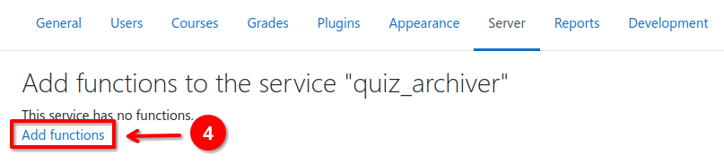
   

### 4. Configure Plugin Settings

1. Navigate to `Site Administration` > `Plugins` (1) > `Activity modules` >
   `Quiz` > `Quiz Archiver` (2)
2. Set `worker_url` (3) to the URL under which the quiz archive worker can be
  reached (e.g., `http://quiz-archive-worker:5000` or `http://127.0.0.1:5000`)
3. Select the previously created `quiz_archiver` webservice for `webservice_id` (4)
   from the drop-down menu
4. Enter the user ID of the previously created Moodle user for `webservice_userid` (5).
   This can easily be found by going to the users profile page and inspecting the
   page URL. It contains the user ID as the `id` query parameter.
5. (Optional) Specify a custom job timeout in minutes
6. (Optional) Specify a custom Moodle base URL. This is only required if you run
   the quiz archive worker in an internal/private network, e.g., when using
   Docker. If this setting is present, the public Moodle `$CFG->wwwroot` will be
   replaced by the `internal_wwwroot` setting.
   Example: `https://your.public.moodle/` will be replaced by `http://moodle.local/`.
7. Save all settings and create your first quiz archive (see [Usage](#usage)).
8. (Optional) Adjust the default (capability)[#capabilities] assignments.

### Known pitfalls

- **Access to (some) webservice functions fails**
  - Ensure that all required webservice functions are enabled for the 
    `quiz_archiver` webservice.
  - Ensure that the `quiz_archiver` webservice has the rights to download and
    upload files.
  - Ensure that the `quiz_archiver` webservice user has accepted all site policies
    (e.g., privacy policy).
- **Upload of the final archive fails**
  - Ensure you have configured `php` to accept large file uploads. The
    `upload_max_filesize` and `post_max_size` settings in your `php.ini` should
    be set to a value that is large enough to allow the upload of the largest
    quiz archive file that you expect to be created.
  - Ensure that your Moodle is configured to allow large file uploads.
    `$CFG->maxbytes` should be set to the same value as PHP `upload_max_filesize`.
  - If you are using an ingress webserver and `php-fpm` via FastCGI, ensure that
    the `fastcgi_send_timeout` and `fastcgi_read_timeout` settings are long
    enough to allow the upload of the largest quiz archive file that you expect.
    Nginx usually signals this problem by returning a '504 Gateway Time-out'
    after 60 seconds (default).
  - Ensure that your antivirus plugin is capable of handling large files. When
    using ClamAV you can control maximum file sizes by setting `MaxFileSize`,
    `MaxScanSize`, and `StreamMaxLength` (when using a TCP socket) inside
    `clamd.conf`.

## Capabilities

The following capabilities are required for the listed actions:

- `mod/quiz_archiver:view` (context: Module): Required to view the quiz archiver
  overview page. It allows to download all created archives but does not allow do
  create new or delete existing archives (read-only access). By default, assigned
  to: `teacher`, `editingteacher`, `manager`.
- `mod/quiz_archiver:archive` (context: Module): Allows creation and deletion of
  quiz archives (read-write access). By default, assigned to: `editingteacher`,
  `manager`.
- `mod/quiz_archiver:use_webservice` (context: System): Required to use any of
  the webservice functions this plugin provides. The webservice user (created in
  [Configuration](#configuration)) needs to have this capability in order to
  create new quiz archives.

## Usage

Once installed and set up, quizzes can be archived by performing the following
steps:

1. Navigate to a Moodle quiz
2. Inside the `Quiz administration` menu expand the `Results` section and click
   on `Quiz Archiver`
3. Select the desired options and start the archive job by clicking the `Archive 
   quiz` button
4. Wait until the archive job is completed. You can now download the archive
   from the `Quiz Archiver` page using the `Download archive` button.

Created archives can be deleted by clicking the `Delete archive` button. Details,
including all selected settings during archive creation, e.g. number of attempts
or included components, can be viewed by clicking the `Details` button.

If you encounter permission errors, ensure that the user has the required
[Capabilities](#capabilities) assigned.

## Screenshots

### Quiz Archiver overview page
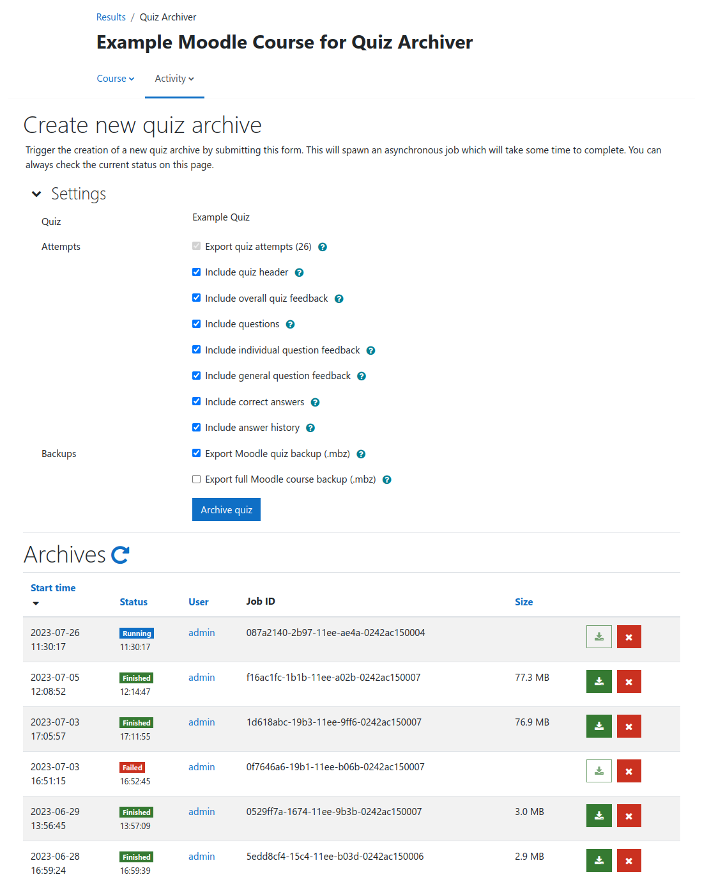

### New job queued while another job is running
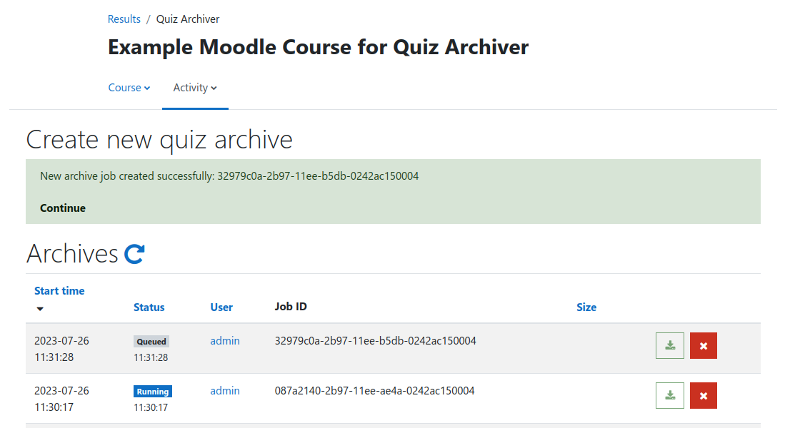

### Quiz archive job details
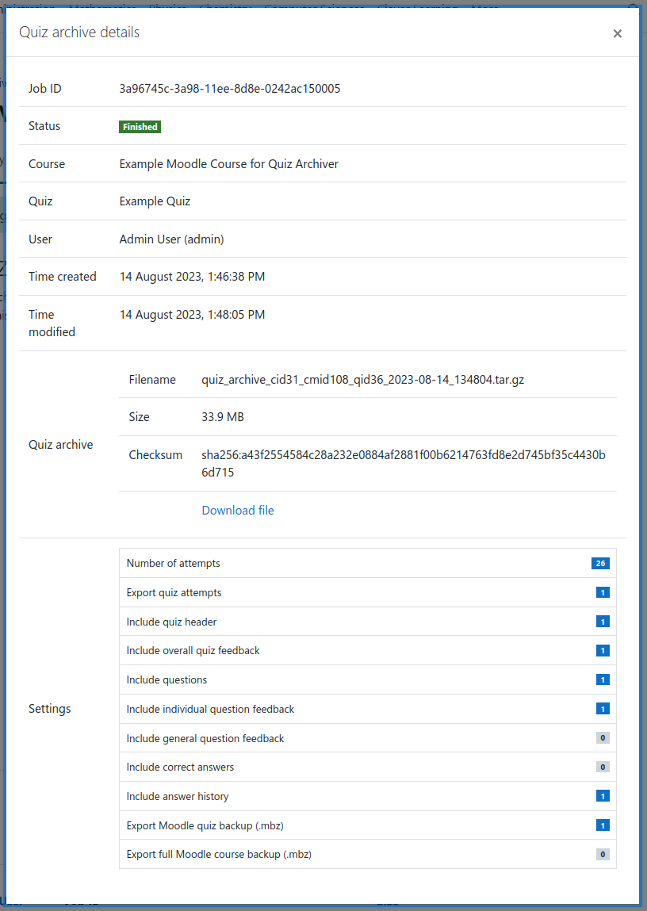

### Example of PDF report (excerpts)
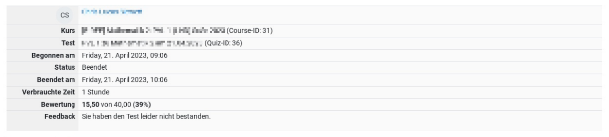

## License

2023 Niels Gandraß <niels@gandrass.de>

This program is free software: you can redistribute it and/or modify it under
the terms of the GNU General Public License as published by the Free Software
Foundation, either version 3 of the License, or (at your option) any later
version.

This program is distributed in the hope that it will be useful, but WITHOUT ANY
WARRANTY; without even the implied warranty of MERCHANTABILITY or FITNESS FOR A
PARTICULAR PURPOSE.  See the GNU General Public License for more details.

You should have received a copy of the GNU General Public License along with
this program.  If not, see <https://www.gnu.org/licenses/>.
