# Quiz Archiver

[](https://github.com/ngandrass/moodle-quiz_archiver/releases)
[](https://github.com/ngandrass/moodle-quiz_archiver/)
[](https://github.com/ngandrass/moodle-quiz_archiver/blob/master/LICENSE)
[](https://github.com/ngandrass/moodle-quiz_archiver/issues)
[](https://github.com/ngandrass/moodle-quiz_archiver/pulls)
[](https://www.paypal.me/ngandrass)
[](https://github.com/sponsors/ngandrass)
[](https://github.com/ngandrass/moodle-quiz_archiver/stargazers)
[](https://github.com/ngandrass/moodle-quiz_archiver/network/members)
[](https://github.com/ngandrass/moodle-quiz_archiver/graphs/contributors)

Archives quiz attempts as PDF and HTML files for long-term storage independent
of Moodle. If desired, Moodle backups (`.mbz`) of both the quiz and the whole
course can be included. A checksum is calculated for every file within the
archive, as well as the archive itself, to allow verification of file integrity.
Archives can optionally be cryptographically signed by a trusted authority using
the [Time-Stamp Protocol (TSP)](https://en.wikipedia.org/wiki/Time_stamp_protocol).
Comprehensive archive settings allow selecting what should be included in the
generated reports on a fine-granular level (e.g., exclude example solutions,
include answer history, ...).

Generated quiz attempt reports include all elements of the test, even complex
ones like [MathJax](https://www.mathjax.org/) formulas, [STACK](https://moodle.org/plugins/qtype_stack)
plots, [GeoGebra](https://www.geogebra.org/) applets, and other question /
content types that require JavaScript processing. All PDF and HTML files are
fully text-searchable, including rendered MathJax formulas. Content is saved
vector based, whenever possible, to allow high-quality printing and zooming
while keeping the file size down.

Quiz archives are created by an external [quiz archive worker](https://github.com/ngandrass/moodle-quiz-archive-worker)
service to remove load from Moodle and to eliminate the need to install a large
number of software dependencies on the webserver. It can easily be [deployed
using Docker](https://github.com/ngandrass/moodle-quiz-archive-worker#installation).

Available via the [Moodle Plugin Directory](https://moodle.org/plugins/quiz_archiver):\
[](https://moodle.org/plugins/quiz_archiver)


-----

## Features

- Archiving of quiz attempts as PDF and HTML files
- Support for file submissions / attachments (e.g., essay files)
- Quiz attempt reports are accessible completely independent of Moodle, hereby
  ensuring long-term readability
- Customization of generated PDF and HTML reports
  - Allows creation of reduced reports, e.g., without example solutions, for
    handing out to students during inspection
- Support for complex content and question types, including Drag and Drop, MathJax
  formulas, STACK plots, and other question / content types that require JavaScript
  processing
- Quiz attempt reports are fully text-searchable, including mathematical formulas 
- Moodle backups (`.mbz`) of both the quiz and the whole course are supported
- Generation of checksums for every file within the archive and the archive itself
- Cryptographic signing of archives and their creation date using the [Time-Stamp Protocol (TSP)](https://en.wikipedia.org/wiki/Time_stamp_protocol)
- Archive and attempt report names are fully customizable and support dynamic
  variables (e.g., course name, quiz name, username, ...)
- Fine granular permission / capability management (e.g., only allow archive
  creation but prevent deletion)
- Allows definition of global archiving defaults as well as forced archiving
  policies (i.e., locked archive job presets that cannot be changed by the user)
- Fully asynchronous archive creation to reduce load on Moodle Server
- Automatic deletion of quiz archives after a specified retention period
- Data compression and vector based MathJax formulas to preserve disk space
- Technical separation of Moodle and archive worker service
- Data-minimising and security driven design

-----

## Concept

Archive jobs are execute via an external quiz archive worker service. It uses the
Moodle webservice API to query the required data and to upload the created archive.

This plugin prepares the archive job within Moodle, provides quiz data to the
archive worker, handles data validation, and stores the created quiz archives
inside the Moodle filestore. Created archives can be managed and downloaded via
the Moodle web interface. A unique webservice access token is generated for every
archive job. Each token has a limited validity and is invalidated either after
job completion or after a specified timeout. This process requires a dedicated
webservice user to be created (see [Configuration](#configuration)). A single job
webservice token can only be used for the specific quiz that is associated with
the job to restrict queryable data to the required minimum.

-----

## Versioning and Compatibility

The [quiz_archiver Moodle Plugin](https://github.com/ngandrass/moodle-quiz_archiver)
and its corresponding [Quiz Archive Worker](https://github.com/ngandrass/moodle-quiz-archive-worker)
both use [Semantic Versioning 2.0.0](https://semver.org/).

This means that their version numbers are structured as `MAJOR.MINOR.PATCH`. The
Moodle plugin and the archive worker service are compatible as long as they use
the same `MAJOR` version number. Minor and patch versions can differ between the
two components without breaking compatibility.

However, it is **recommended to always use the latest version** of both the
Moodle plugin and the archive worker service to ensure you get all the latest
bug fixes, features, and optimizations.


### Compatibility Examples

| Moodle Plugin | Archive Worker | Compatible |
|------------|----------------|------------|
| 1.0.0      | 1.0.0          | Yes        |
| 1.2.3      | 1.0.0          | Yes        |
| 1.0.0      | 1.1.2          | Yes        |
| 2.1.4      | 2.0.1          | Yes        |
|            |                |            |
| 2.0.0      | 1.0.0          | No         |
| 1.0.0      | 2.0.0          | No         |
| 2.4.2      | 1.4.2          | No         |


### Development / Testing Versions

Special development versions, used for testing, can be created but will never be
published to the Moodle plugin directory. Such development versions are marked
by a `+dev-[TIMESTAMP]` suffix, e.g., `2.4.2+dev-2022010100`.

-----

## Installation

You can install this plugin like any other Moodle plugin, as described below.
However, keep in mind that you additionally need to deploy the external quiz
archive worker service for this plugin to work.


### Installing via uploaded ZIP file

1. Log in to your Moodle site as an admin and go to _Site administration >
   Plugins > Install plugins_.
2. Upload the ZIP file with the plugin code. You should only be prompted to add
   extra details if your plugin type is not automatically detected.
3. Check the plugin validation report and finish the installation.


### Installing manually

The plugin can be also installed by putting the contents of this directory to

    {your/moodle/dirroot}/mod/quiz/report/archiver

Afterward, log in to your Moodle site as an admin and go to _Site administration >
Notifications_ to complete the installation.

Alternatively, you can run

    $ php admin/cli/upgrade.php

to complete the installation from the command line.


## Configuration

The following sections describe the required steps to set up the plugin.

In summary: You need to create a dedicated Moodle user, a global role to manage
permissions, setup a webservice for the archive worker, and set configuration
options for the Moodle plugin.


### Prerequisites

Installation of the additional [quiz archive worker service](https://github.com/ngandrass/moodle-quiz-archive-worker)
is mandatory for this plugin to work.

**Detailed installation instructions can be found here:
[Quiz Archive Worker: Installation](https://github.com/ngandrass/moodle-quiz-archive-worker#installation)**


### Automatic Configuration

Creation of the dedicated Moodle user and role, as well as the setup of the
webservice for the archive worker, can be done automatically.

The easiest way is to use the automatic configuration feature provided via the
Moodle admin interface.

1. Navigate to _Site Administration_ > _Plugins_ (1) > _Activity modules_ >
   _Quiz_ > _Quiz Archiver_ (2)
2. Click the _Automatic configuration_ button (3)
3. Enter the URL under which the quit archive worker can be reached (4)
4. (Optional) Change the configuration defaults (5)
5. Execute the automatic configuration (6)
6. Close the window (7)
7. (Optional) Adjust the default plugin setting on the plugin settings page

[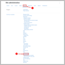](docs/assets/configuration/configuration_plugin_settings_1.png)
[](docs/assets/configuration/configuration_plugin_autoinstall_2.png)
[](docs/assets/configuration/configuration_plugin_autoinstall_3.png)
[](docs/assets/configuration/configuration_plugin_autoinstall_4.png)


#### Using the Command Line Interface (CLI)

<details>
<summary><b>Expand here to show CLI configuration instructions</b></summary>

If you want to configure this plugin in an automated fashion, you can use the
provided CLI script. The script is located at
`{$CFG->wwwroot}/mod/quiz/report/archiver/cli/autoinstall.php`.

To execute the script:

1. Open a terminal and navigate to the quiz archiver CLI directory:
   ```bash
   cd /path/to/moodle/mod/quiz/report/archiver/cli
   ```
2. Execute the CLI script using PHP:
    ```bash
    php autoinstall.php --help
    ```

Usage:
```text
Automatically configures Moodle for use with the quiz archiver plugin.

ATTENTION: This CLI script ...
- Enables web services and REST protocol
- Creates a quiz archiver service role and a corresponding user
- Creates a new web service with all required webservice functions
- Authorises the user to use the webservice.

Usage:
    $ php autoinstall.php
    $ php autoinstall.php --username="my-custom-archive-user"
    $ php autoinstall.php [--help|-h]

Options:
    --help, -h          Show this help message
    --force, -f         Force the autoinstall, regardless of the current state of the system
    --workerurl=<value> Sets the URL of the worker (default: http://localhost:8080)
    --wsname=<value>    Sets a custom name for the web service (default: quiz_archiver_webservice)
    --rolename=<value>  Sets a custom name for the web service role (default: quiz_archiver)
    --username=<value>  Sets a custom username for the web service user (default: quiz_archiver_serviceaccount)
```
</details>


### Manual Configuration

<details>
<summary><b>Expand here to show manual configuration instructions</b></summary>

### 1. Create Moodle User and Role

1. Create a designated Moodle user for the quiz archiver webservice
   1. Navigate to _Site Administration_ > _Users_ (1) > _Accounts_ > _Add a new user_ (2)
   2. Set a username (e.g. `quiz_archiver`) (3), a password (4), first and
      lastname (5), and a hidden email address (6)
   3. Create the user (7)
   
   [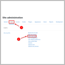](docs/assets/configuration/configuration_create_moodle_user_1.png)
   [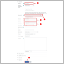](docs/assets/configuration/configuration_create_moodle_user_2.png)

2. Create a global role to handle permissions for the `quiz_archiver` Moodle user
   1. Navigate to _Site Administration_ > _Users_ (1) > _Permissions_ > _Define roles_ (2)
   2. Select _Add a new role_ (3)
   3. Set _Use role or archetype_ (4) to `No role`
   4. Upload the role definitions file from [res/moodle_role_quiz_archiver.xml](res/moodle_role_quiz_archiver.xml) (5).
      This will automatically assign all required capabilities. You can check all
      capabilities prior to role creation in the next step or by manually
      inspecting the [role definition XML file](res/moodle_role_quiz_archiver.xml).
   5. Click on _Continue_ (6) to import the role definitions for review
   6. Optionally change the role name or description and create the role (7)
   
   [](docs/assets/configuration/configuration_create_role_1.png)
   [](docs/assets/configuration/configuration_create_role_2.png)
   [](docs/assets/configuration/configuration_create_role_3.png)
   [](docs/assets/configuration/configuration_create_role_4.png)

3. Assign the `quiz_archiver` Moodle user to the created role
   1. Navigate to _Site Administration_ > _Users_ (1) > _Permissions_ > _Assign system roles_ (2)
   2. Select the `Quiz Archiver Service Account` role (3)
   3. Search the created `quiz_archiver` Moodle user (4), select it in the list
      of potential users (5), and add it to the role (6)
   
   [](docs/assets/configuration/configuration_assign_role_1.png)
   [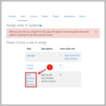](docs/assets/configuration/configuration_assign_role_2.png)
   [](docs/assets/configuration/configuration_assign_role_3.png)

### 2. Setup Webservice

1. Enable webservices globally
   1. Navigate to _Site Administration_ > _Server_ (1) > _Web services_ > _Overview_ (2)
   2. Click on _Enable web services_ (3), check the checkbox (4), and save the
      changes (5)
   3. Navigate back to the _Overview_ (2) page
   4. Click on _Enable protocols_ (6), enable the _REST protocol_ (7), and save the
      changes (8)
   
   [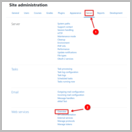](docs/assets/configuration/configuration_enable_webservices_1.png)
   [](docs/assets/configuration/configuration_enable_webservices_2.png)
   [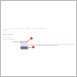](docs/assets/configuration/configuration_enable_webservices_3.png)
   [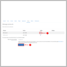](docs/assets/configuration/configuration_enable_webservices_4.png)

2. Create an external webservice for the quiz archive worker to use
   1. Navigate to _Site Administration_ > _Server_ (1) > _Web services_ > _External services_ (2)
   2. Under the _Custom services_ section, select _Add_ (3)
   3. Enter a name (e.g. `quiz_archiver`) (4) and enable it (5)
   4. Expand the additional settings (6), enable file up- and download (7)
   5. Create the new webservice by clicking _Add service_ (8)

   [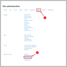](docs/assets/configuration/configuration_create_webservice_1.png)
   [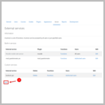](docs/assets/configuration/configuration_create_webservice_2.png)
   [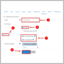](docs/assets/configuration/configuration_create_webservice_3.png)

3. Add all `quiz_archiver_*` webservice functions to the `quiz_archiver` external
   service
   1. Navigate to _Site Administration_ > _Server_ (1) > _Web services_ > _External services_ (2)
   2. Open the _Functions_ page for the `quiz_archiver` webservice (3)
   3. Click the _Add functions_ link (4)
   4. Search for `quiz_archiver` (5) and add all `quiz_archiver_*` functions
   5. Save the changes by clicking _Add functions_ (6)

   [](docs/assets/configuration/configuration_assign_webservice_functions_1.png)
   [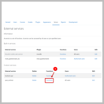](docs/assets/configuration/configuration_assign_webservice_functions_2.png)
   [](docs/assets/configuration/configuration_assign_webservice_functions_3.png)
   [](docs/assets/configuration/configuration_assign_webservice_functions_4.png)


### 3. Configure Plugin Settings

1. Navigate to _Site Administration_ > _Plugins_ (1) > _Activity modules_ >
   _Quiz_ > _Quiz Archiver_ (2)
2. Set `worker_url` (3) to the URL under which the quiz archive worker can be
  reached (e.g., `http://quiz-archive-worker:5000` or `http://127.0.0.1:5000`)
3. Select the previously created `quiz_archiver` webservice for `webservice_id` (4)
   from the drop-down menu
4. Enter the user ID of the previously created Moodle user for `webservice_userid` (5).
   It can easily be found by navigating to the users profile page and inspecting
   the page URL. It contains the user ID as the `id` query parameter.
5. (Optional) Specify a custom job timeout in minutes
6. (Optional) Specify a custom Moodle base URL. This is only required if you run
   the quiz archive worker in an internal/private network, e.g., when using
   Docker. If this setting is present, the public Moodle `$CFG->wwwroot` will be
   replaced by the `internal_wwwroot` setting.
   Example: `https://your.public.moodle/` will be replaced by `http://moodle.local/`.
7. Save all settings and create your first quiz archive (see [Usage](#usage)).
8. (Optional) Adjust the default [capability](#capabilities) assignments.

[](docs/assets/configuration/configuration_plugin_settings_1.png)
[](docs/assets/configuration/configuration_plugin_settings_2.png)

</details>

### Known Pitfalls

- **Job timeout prior to configured value**
  - Be aware that there is a configurable job timeout within the Moodle plugin
    settings (`quiz_archiver | job_timeout_min`) as well as one within the quiz
    archive worker service (`QUIZ_ARCHIVER_REQUEST_TIMEOUT_SEC`). Since the
    shortest timeout always takes precedence, make sure to adjust both settings
    as required.
- **Access to (some) webservice functions fails**
  - Ensure that webservices and the REST protocol are enabled globally.
  - Ensure that all required webservice functions are enabled for the 
    `quiz_archiver` webservice.
  - Ensure that the `quiz_archiver` webservice has the rights to download and
    upload files.
  - Ensure that the `quiz_archiver` webservice user has accepted all site policies
    (e.g., privacy policy).
- **Upload of the final archive fails**
  - Ensure you have configured `php` to accept large file uploads. The
    `upload_max_filesize` and `post_max_size` settings in your `php.ini` should
    be set to a value that is large enough to allow the upload of the largest
    quiz archive file that you expect to be created.
  - Ensure that your Moodle is configured to allow large file uploads.
    `$CFG->maxbytes` should be set to the same value as PHP `upload_max_filesize`.
  - If you are using an ingress webserver and `php-fpm` via FastCGI, ensure that
    the `fastcgi_send_timeout` and `fastcgi_read_timeout` settings are long
    enough to allow the upload of the largest quiz archive file that you expect.
    Nginx usually signals this problem by returning a '504 Gateway Time-out'
    after 60 seconds (default).
  - Ensure that your antivirus plugin is capable of handling large files. When
    using ClamAV you can control maximum file sizes by setting `MaxFileSize`,
    `MaxScanSize`, and `StreamMaxLength` (when using a TCP socket) inside
    `clamd.conf`.


## Capabilities

The following capabilities are required for the listed actions:

- `mod/quiz_archiver:view` (context: Module): Required to view the quiz archiver
  overview page. It allows to download all created archives but does not allow do
  create new or delete existing archives (read-only access). By default, assigned
  to: `teacher`, `editingteacher`, `manager`.
- `mod/quiz_archiver:create` (context: Module): Allows creation of new quiz
   archives (read-write access). By default, assigned to: `editingteacher`,
  `manager`.
- `mod/quiz_archiver:delete`, (context: Module): Allows deletion of existing
  quiz archives (read-write access). By default, assigned to: `editingteacher`,
  `manager`.
- `mod/quiz_archiver:use_webservice` (context: System): Required to use any of
  the webservice functions this plugin provides. The webservice user (created in
  [Configuration](#configuration)) needs to have this capability in order to
  create new quiz archives.

-----

## Usage

Once installed and set up, quizzes can be archived by performing the following
steps:

1. Navigate to a Moodle quiz
2. Inside the `Quiz administration` menu expand the `Results` section and click
   on `Quiz Archiver`
3. Select the desired options and start the archive job by clicking the `Archive 
   quiz` button
4. Wait until the archive job is completed. You can now download the archive
   from the `Quiz Archiver` page using the `Download archive` button.

Created archives can be deleted by clicking the `Delete archive` button. Details,
including all selected settings during archive creation, e.g. number of attempts
or included components, can be viewed by clicking the `Details` button.

If you encounter permission errors, ensure that the user has the required
[Capabilities](#capabilities) assigned.


## Advanced Usage

This section discusses advanced usage of the plugin.


### Archive job presets (global defaults / policies)

Default values for all archive job options can be configured globally via the
plugin settings page. By default, users are allowed to customize these settings
during archive creation. However, each setting can be locked individually to
prevent users from modifying it during archive creation. This allows the
enforcement of organization wide policies for archived quizzes.

To customize these options:

1. Navigate to _Site Administration_ > _Plugins_ (1) > _Activity modules_ >
   _Quiz_ > _Quiz Archiver_ (2)
2. Scroll down to the _Archive presets_ section (3)
3. Set the desired default values for each option (4)
   - Options can depend on another, as indicated by (6). This causes the
     dependent option to be disabled, if the parent option is not set (e.g.,
     question feedback is not exported if question exporting is fully disabled)
   - More options than shown in the screenshots are available. Scroll down to
     see all (7)
4. (Optional) Lock individual options by checking the _Lock_ checkbox (5)

Locked options will be grayed out during archive creation (8).

[](docs/assets/configuration/configuration_plugin_settings_1.png)
[](docs/assets/configuration/configuration_archive_job_presets_2.png)
[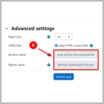](docs/assets/configuration/configuration_archive_job_presets_3.png)


### Image optimization / compression

If quizzes contain a large number of images or images with an excessively high
resolutions (e.g., 4000x3000 px), the quiz archiver can compress such images
during archiving. This can significantly reduce the size of the generated
PDF files. HTML source files, if generated, are never modified and remain
untouched.

To enable image optimization for a quiz archive job:

1. Navigate to the quiz archiver overview page
2. Expand the _Advanced settings_ section of the _Create new quiz archive_ form
3. Check the _Optimize images_ checkbox (1)
4. Set the desired maximum dimensions and quality (2)
   - If an image exceeds any of the specified dimensions, it will be resized
     proportionally to fit within the specified bounds.
   - The quality setting controls the compression level of the images. A value
     of 100% will result in no compression, while a value of 0% will result in
     the lowest quality and smallest file size. A value of 85% is a good
     compromise between quality and file size.
5. Continue with the archive creation as usual

_Note: It is strongly advised to lock quality settings to global defaults using
the [archive job presets](#archive-job-presets-global-defaults--policies)._

[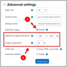](docs/assets/configuration/configuration_job_image_optimization.png)


### Automatic deletion of quiz archives (retention policy)

Quiz archives can be automatically deleted after a specified retention period.
Automatic deletion can either be controlled on a per-archive basis or globally
via the [archive job presets](#archive-job-presets-global-defaults--policies).
Archives with expired lifetimes are deleted by an asynchronous task that is, by
default, scheduled to run every hour. Only the archived user data (attempt PDFs,
attachments, ...) is deleted, while the job metadata is kept until manually
deleted. This procedure allows to document the deletion of archive data in a
traceable manner, while the privacy relevant user data is deleted.


If an archive is scheduled for automatic deletion, its remaining lifetime is
shown in the job details modal, as depict above. You can access it via the
_Show details_ button on the quiz archiver overview page. Once deleted, archives
change their status from _'Finished'_ to _'Deleted'_. If you try to delete an
archive that is scheduled for automatic deletion before its retention period
expired, an extra warning message will be shown.

#### Enable automatic deletion for a single quiz archive

To enable the scheduled deletion for a single quiz archive:

1. Navigate to the quiz archiver overview page
2. Expand the _Advanced settings_ section of the _Create new quiz archive_ form
3. Check the _Automatic deletion_ checkbox (1)
4. Set the desired retention period (2)
5. Create the archive job (3)

[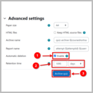](docs/assets/configuration/configuration_job_autodelete.png)


#### Enable automatic deletion globally

Like any other archive settings, automatic deletion can be configured globally
using the [archive job presets](#archive-job-presets-global-defaults--policies).


### Quiz archive signing using the Time-Stamp Protocol (TSP)

Quiz archives and their creation date can be digitally signed by a trusted
authority using the [Time-Stamp Protocol (TSP)](https://en.wikipedia.org/wiki/Time_stamp_protocol)
according to [RFC 3161](https://www.ietf.org/rfc/rfc3161.txt). This can be used
to cryptographically prove the integrity and creation date of the archive at a
later point in time. Quiz archives can be signed automatically at creation or
manually later on.

#### Enable archive signing globally

1. Navigate to _Site Administration_ > _Plugins_ (1) > _Activity modules_ >
   _Quiz_ > _Quiz Archiver_ (2)
2. Set `tsp_server_url` (3) to the URL of your desired TSP service
3. Globally enable archive signing by checking `tsp_enable` (4)
4. (Optional) Enable automatic archive signing by checking `tsp_automatic_signing` (5)
5. Save all settings (6)

[](docs/assets/configuration/configuration_plugin_settings_1.png)
[](docs/assets/configuration/configuration_tsp_settings_2.png)


#### Accessing TSP data

Both the TSP query and the TSP response can be accessed via the job details
dialog. To do so, navigate to the quiz archiver overview page and click the
_Show details_ button for the desired archive job.


#### Automatic archive signing

If enabled, new archives will be automatically signed during creation. TSP data
can be accessed via the _Show details_ button of an archive job on the quiz
archiver overview page. Existing archives will not be signed automatically (see
[Manual archive signing](#manual-archive-signing)).

#### Manual archive signing

To manually sign a quiz archive, navigate to the quiz archiver overview page,
click the _Show details_ button for the desired archive job, and click the
_Sign archive now_ button.

#### Validating an archive and its signature

To validate an archive and its signature, install `openssl` and follow these
steps:

1. Obtain the certificate files from your TSP authority (`.crt` and `.pem`)
2. Navigate to the quiz archiver overview page and click the _Show details_
   button for the desired archive job
3. Download the archive and both TSP signature files (`.tsq` and `.tsr`)
4. Inspect TSP response to see time stamp and signed hash value
   1. Execute: `openssl ts -reply -in <archive>.tsr -text`
5. Verify the quiz archive against the TSP response. This process confirms that
   the archive was signed by the TSP authority and that the archive was not
   modified after signing, i.e., the hash values of the file matches the TSP
   response.
   1. Execute: `openssl ts -verify -in <archive>.tsr -data <archive>.tar.gz -CAfile <tsa>.pem -untrusted <tsa>.crt`
   2. Verify that the output is `Verification: OK` \
      Errors are indicated by `Verification: FAILED`
6. (Optional) Verify that TSP request and TSP response match
   1. Execute: `openssl ts -verify -in <archive>.tsr -queryfile <archive>.tsq -CAfile <tsa>.pem -untrusted <tsa>.crt`
   2. Verify that the output is `Verification: OK` \
      Errors are indicated by `Verification: FAILED`


## Testing

For testing, a Moodle course that contains a reference quiz is provided. The quiz
features an instance of every standard question type that is provided by Moodle.
Example students are enrolled and possess graded attempts, ready to test the
archive functionality.

You can import the reference course from the corresponding Moodle backup file
located at [res/backup-moodle2-course-qa-ref.mbz](res/backup-moodle2-course-qa-ref.mbz).

-----

## Screenshots

### Quiz Archiver overview page


### New job queued while another job is running


### Quiz archive job details


### Example of PDF report (excerpts)


-----

## License

2024 Niels Gandraß <niels@gandrass.de>

This program is free software: you can redistribute it and/or modify it under
the terms of the GNU General Public License as published by the Free Software
Foundation, either version 3 of the License, or (at your option) any later
version.

This program is distributed in the hope that it will be useful, but WITHOUT ANY
WARRANTY; without even the implied warranty of MERCHANTABILITY or FITNESS FOR A
PARTICULAR PURPOSE.  See the GNU General Public License for more details.

You should have received a copy of the GNU General Public License along with
this program.  If not, see <https://www.gnu.org/licenses/>.
